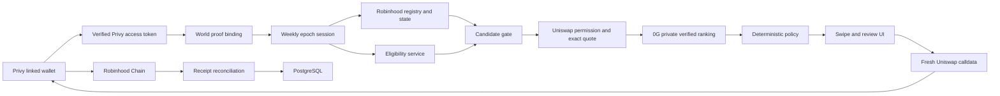

# Architecture

## Trust boundaries

- Browser input carries a short-lived Privy access token and active EVM address. The backend
  verifies the token with Privy and confirms the address is linked to that user before applying
  Zod validation to request data.
- World proof payloads are forwarded server-side and bound to the authenticated wallet. Only an HMAC digest of the nullifier is stored.
- Stock eligibility is a separate server-side dependency. World is not treated as KYC.
- 0G receives minimized structured candidates, not keys, signatures, World identifiers, or raw proof payloads.
- The model cannot invent addresses or amounts. Its output must match the input commitment and candidate set.
- Uniswap credentials and calls stay server-side. The browser receives only wallet-signable transactions that were checked for chain, sender, non-empty calldata, and commitment.
- The browser broadcasts. The backend reconciles transaction sender, calldata commitment, chain receipt, and terminal outcome.

## State guarantees

- Unique `(wallet, epoch_id)` weekly session.
- Unique execution per weekly session.
- A prepared execution may refresh quotes/call commitments only when the authorized basket hash is unchanged.
- Submitted or terminal executions cannot return to a prepared state.
- Exits are a separate workflow and are not blocked by the weekly buy state.
