# Current architecture

## Runtime composition

`src/server/bootstrap.ts` selects providers from the runtime mode:

| Concern | Demo | Local live | Production |
|---|---|---|---|
| State | `MemoryStateStore` | `MemoryStateStore` | `PostgresStateStore` |
| Candidates | `DemoProvider` | Robinhood `LiveCandidateProvider`; Solana Jupiter or 0x provider | Same chain-specific providers |
| Ranking | Account-selected `DeterministicRanker` or configured `ZeroGProvider` | Same | Same; production configuration requires 0G to be available |
| Buy execution | `DemoProvider`, no broadcast | Robinhood 0x/Uniswap; Solana Jupiter/0x | Same chain-specific providers |
| Icons | CoinGecko provider with local fallback behavior | Same | Same |
| Card prices and history | CoinGecko with demo fallback | CoinGecko | CoinGecko |
| Portfolio index | Alchemy when an Alchemy RPC URL is configured | Same | Same |

```mermaid
flowchart LR
  U["User"] --> P["Privy login"]
  P --> CH["Chain and execution wallet"]
  CH -->|"Robinhood"| EVM["Embedded signer plus ERC-4337 wallet"]
  CH -->|"Solana"| SVM["Connected Solana wallet"]
  EVM --> A["Authenticated cadence session"]
  SVM --> A
  A --> C["Chain-specific candidate discovery"]
  C --> M["Market metadata enrichment"]
  M --> Z["Deterministic or 0G ranking"]
  Z --> D["Deterministic feed policy"]
  D --> UI["Cards and basket review"]
  UI --> F["Fresh quotes and prepared plan"]
  F --> B["Browser plan-hash check"]
  B --> EP["ERC-4337 call-array preflight"]
  B --> SP["Solana transaction simulation"]
  EP --> RH["Robinhood Chain atomic operation"]
  SP --> SOL["Solana atomic transaction"]
  RH --> X["Receipt transfer reconciliation"]
  SOL --> X2["Signature and token-delta reconciliation"]
  X --> ST["PostgreSQL or memory store"]
  X2 --> ST
```

## Client state model

`src/client/App.tsx` owns the top-level product state:

- `stage`: onboarding, loading, swipe, or review.
- `view`: Basket, Portfolio, Activity, or Account.
- active cadence session and feed.
- active chain, execution provider, ranking provider, and chain-specific wallet.
- current card index and selected asset IDs.
- latest prepared/submitted/terminal execution.
- receipt candidate snapshot and feed pagination state.

Authentication loss resets product state to onboarding. Saved onboarding preferences are keyed by Privy user ID, while the latest execution snapshot is keyed by Investmade Wallet address. Both are browser-origin local state, not authoritative server records.

## API boundary

The Express API exposes:

- `GET /api/health` and `GET /api/config`
- public asset icon, details, and history reads
- Robinhood USDG and Solana SOL/USDC balance reads
- Alchemy-backed Robinhood and Solana portfolio reads
- an allowlisted Solana RPC proxy used by the browser wallet stack
- cadence session open
- feed generation
- execution prepare, demo settle, submitted marker, reconciliation, and execution read
- chain-specific position exit quote preparation, plus Solana exit submit/status routes

Production and local-live requests use Privy bearer authentication. The server verifies the access token, selected chain, and that the requested EVM smart wallet or Solana wallet belongs to the Privy user. Pure demo execution substitutes fixed demo identities and does not accept that behavior as production evidence.

## Candidate discovery

Robinhood ranking discovery combines the static registry, active Robinhood stock-token catalog, and bounded Uniswap pool discovery. Solana discovery comes from the selected Jupiter or 0x provider. Both apply user exclusions and risk-mode community-asset rules before returning up to thirty ranking candidates and ten cards per page.

Feed browsing and execution preparation deliberately have different costs and guarantees:

- The live Robinhood feed keeps CoinGecko-listed assets with safe icons but does not spend provider quotes or run the complete onchain execution preflight for every card.
- Deterministic ranking alternates available crypto and stock-token results while preserving score order inside each group.
- User-visible category tags are normalized and filtered by `src/domain/asset-tag-config.ts`; tag styling is metadata, not an execution guarantee.
- Review re-resolves only the selected assets and performs the full provider and policy validation.

For a selected Robinhood stock token, execution preparation requires:

- active Robinhood asset/deployment metadata for chain `4663`;
- deployed contract code;
- a non-halted price record;
- an unpaused onchain oracle;
- fresh exact-input provider liquidity and token authorization.

Execution can reconstruct a provider-discovered Robinhood crypto asset from a canonical `rh:4663:<contract>` ID after a discovery-cache restart. Solana providers similarly recover supported assets from their mint ID. The policy still rejects malformed or invented identities.

Production rejects stale Robinhood price evidence during execution preparation. Local-live accepts an active, non-halted stock token during off-hours even when the price timestamp is stale, and labels the environment as local-live.

There is no separate stock-eligibility provider in the current runtime.

## Ranking and deterministic policy

The ranking provider receives a bounded, committed input containing:

- session and cadence epoch;
- exact period and ticket budgets;
- risk and asset-class preferences;
- only candidates that passed discovery;
- an input commitment.

Production configuration requires the 0G provider to be available, while the saved account preference can select either verified 0G or deterministic ranking. Any returned output must match the requested provider, input commitment, policy version, candidate set, unique asset constraint, ranking bounds, and period budget. Neither provider can introduce token addresses, change amounts, or produce wallet calldata.

## Atomic buy execution

### Robinhood Chain

`POST /api/executions/prepare`:

1. Verifies session ownership and the requested basket.
2. Rechecks live selected candidates.
3. Verifies sufficient Investmade Wallet USDG in live modes.
4. Requests fresh 0x quotes, requires one shared AllowanceHolder spender, and constructs one exact-total approval followed by all swaps.
5. Validates quote policy and creates call commitments.
6. Stores a prepared execution bound to the authorized plan hash.

The client independently verifies that the prepared plan still matches the visible review basket and that enough quote lifetime remains. It then prepares and submits one smart-wallet user operation containing the complete call array.

The backend accepts the submitted buy hash only with `batched: true`. Reconciliation checks:

- the chain receipt terminal state;
- exact total USDG transferred from the authenticated wallet;
- minimum output-token transfers back to that wallet;
- persisted plan and call commitments.

The current atomic path should normally produce `SETTLED` or `FAILED`. `PARTIAL` remains in the execution/receipt model for older or non-atomic records.

### Solana

`POST /api/executions/prepare` follows the same session, selection, plan-hash, and quote-freshness boundary, then:

1. Reads the signing wallet's USDC balance and rejects insufficient funds before provider candidate work.
2. Requests exact-input Jupiter or 0x instructions for the selected mints.
3. Composes one versioned transaction, simulates the complete message, rejects unexpected signers or an oversized packet, and stores its message commitment and expected balance changes.
4. Accepts only a signed transaction matching that prepared message.
5. Submits one signature and polls it to a terminal RPC state.
6. Reconciles every expected token delta; native SOL output is separated from token-account rent changes.

Provider rate limits and one transient build or route-specific simulation failure receive bounded retries. Explicit insufficient-funds errors are terminal for that preparation attempt.

## Exit execution

Exits are intentionally separate from the cadence buy state:

1. The server prepares a fresh reverse quote for one supported position through the active chain/provider.
2. A Robinhood single-position exit preflights and submits its complete call array as one smart-wallet operation.
3. Robinhood **Exit all positions** prepares all current holdings in parallel, excludes holdings without a current route, then preflights and submits every remaining call in one atomic smart-wallet operation.
4. A Solana exit signs one prepared versioned transaction, submits it through the active provider, and polls its signature until `SETTLED` or `FAILED`.

Multi-position Solana exit is intentionally unavailable. The Robinhood UI currently clears a submitted exit after the smart-wallet send promise resolves, but that acknowledgement is not independent settlement proof. Receipt and post-exit balance verification therefore remain mandatory release evidence.

## Trust boundaries

- Provider secrets and database credentials are server-only.
- 0G receives bounded preferences/candidates, never keys, signatures, or wallet secrets.
- 0x responses are treated as untrusted route material until actor, chain, token pair, calldata, amounts, expiry, simulation, balance, and price-impact policy are validated.
- Jupiter and 0x Solana instructions are treated as untrusted until account keys, signers, input mint, amounts, message size, simulation, and message commitment are validated.
- The approval spender comes only from `issues.allowance.spender` or `allowanceTarget`; the Settler transaction target is never approved.
- The server has no user signing key and cannot broadcast a buy without the wallet.
- A quote, HTTP success, signing request, or transaction hash is not settlement.

## Persistent guarantees

Production PostgreSQL enforces:

- a unique `(wallet, epoch_id)` cadence session;
- one reserved execution per session;
- atomic replacement of an unsigned `PREPARED` plan when the visible basket changes, guarded by the previous authorized plan hash;
- no return from submitted/terminal status to prepared.

Demo and local-live use nonce-suffixed cadence epochs so developers can create repeatable baskets without changing production idempotency.
