# Current architecture

## Runtime composition

`src/server/bootstrap.ts` selects providers from the runtime mode:

| Concern | Demo | Local live | Production |
|---|---|---|---|
| State | `MemoryStateStore` | `MemoryStateStore` | `PostgresStateStore` |
| Candidates | `DemoProvider` | `LiveCandidateProvider` | `LiveCandidateProvider` |
| Ranking | `ZeroGProvider` when configured, otherwise `DemoProvider` | `ZeroGProvider` when configured, otherwise `DemoProvider` | `ZeroGProvider` required by configuration |
| Buy execution | `DemoProvider` | `UniswapProvider` | `UniswapProvider` |
| Icons | CoinGecko provider with local fallback behavior | Same | Same |
| Price history | Demo history | Demo history because demo mode is active | Graph/Substreams provider when configured |

```mermaid
flowchart LR
  U["User"] --> P["Privy login"]
  P --> E["Embedded signer"]
  E --> W["Investmade ERC-4337 wallet"]
  W --> A["Privy access token plus wallet address"]
  A --> O{"World fully configured?"}
  O -->|"yes"| H["World proof bound to wallet"]
  O -->|"no"| S["Cadence session"]
  H --> S
  S --> R["Canonical asset registry"]
  R --> C["Contract and Robinhood market checks"]
  C --> Q["Uniswap permission and exact-size quote"]
  Q --> Z["0G or local bounded ranking"]
  Z --> D["Deterministic feed policy"]
  D --> UI["Cards and basket review"]
  UI --> F["Fresh quotes and wallet calls"]
  F --> B["Browser plan-hash check"]
  B --> PF["Full ERC-4337 preflight"]
  PF --> W
  W -->|"one atomic buy confirmation"| RH["Robinhood Chain"]
  RH --> X["Receipt and transfer reconciliation"]
  X --> ST["PostgreSQL or memory store"]
```

## Client state model

`src/client/App.tsx` owns the top-level product state:

- `stage`: onboarding, loading, swipe, or review.
- `view`: Basket, Portfolio, Activity, or Account.
- active cadence session and feed.
- current card index and selected asset IDs.
- latest prepared/submitted/terminal execution.
- receipt candidate snapshot and feed pagination state.

Authentication loss resets product state to onboarding. Saved onboarding preferences are keyed by Privy user ID, while the latest execution snapshot is keyed by Investmade Wallet address. Both are browser-origin local state, not authoritative server records.

## API boundary

The Express API exposes:

- `GET /api/health` and `GET /api/config`
- public asset icon/history reads
- USDG balance reads
- optional World signature and verification
- cadence session open
- feed generation
- execution prepare, demo settle, submitted marker, reconciliation, and execution read
- position exit quote preparation

Production and local-live requests use Privy bearer authentication. The server verifies the access token and confirms that the requested smart-wallet address is linked to the Privy user. Pure demo execution substitutes a fixed demo wallet and does not accept that behavior as production evidence.

## Candidate discovery

The live candidate provider starts with `ASSET_REGISTRY`, applies user exclusions and risk-mode community-asset rules, and discovers up to ten candidates per page.

For every asset it requires deployed contract code and a fresh exact-size Uniswap quote. Stock-token routes also require:

- active Robinhood asset/deployment metadata for chain `4663`;
- a non-halted price record;
- an unpaused onchain oracle;
- wallet-specific Uniswap permission.

Production rejects stale Robinhood price evidence. Local-live accepts an active, non-halted stock token during off-hours even when the price timestamp is stale, and labels the environment as local-live.

There is no separate stock-eligibility provider in the current runtime.

## Ranking and deterministic policy

The ranking provider receives a bounded, committed input containing:

- session and cadence epoch;
- exact period and ticket budgets;
- risk and asset-class preferences;
- only candidates that passed discovery;
- an input commitment.

Production requires 0G. The returned output must match the input commitment, policy version, candidate set, unique asset constraint, ranking bounds, and period budget. The model cannot introduce token addresses, change amounts, or produce wallet calldata.

## Atomic buy execution

`POST /api/executions/prepare`:

1. Verifies session ownership and the requested basket.
2. Rechecks live selected candidates.
3. Verifies sufficient Investmade Wallet USDG in live modes.
4. Requests fresh Uniswap approvals, Permit2 calls, and swaps.
5. Validates quote policy and creates call commitments.
6. Stores a prepared execution bound to the authorized plan hash.

The client independently verifies that the prepared plan still matches the visible review basket and that enough quote lifetime remains. It then prepares and submits one smart-wallet user operation containing the complete call array.

The backend accepts the submitted buy hash only with `batched: true`. Reconciliation checks:

- the chain receipt terminal state;
- exact total USDG transferred from the authenticated wallet;
- minimum output-token transfers back to that wallet;
- persisted plan and call commitments.

The current atomic path should normally produce `SETTLED` or `FAILED`. `PARTIAL` remains in the execution/receipt model for older or non-atomic records.

## Exit execution

Exits are intentionally separate from the cadence buy state:

1. The server prepares a fresh reverse Uniswap quote for one supported position.
2. The browser submits returned wallet calls sequentially through the connected wallet.
3. Each receipt must succeed before the next call is sent.

“Exit all” repeats this flow for each holding. It is not atomic across assets and can stop after a failure.

## Trust boundaries

- Provider secrets, database credentials, and World signing material are server-only.
- World is an optional human-verification gate, not authentication, KYC, or spending authority.
- 0G receives bounded preferences/candidates, never keys, signatures, World proof payloads, or wallet secrets.
- Uniswap responses are treated as untrusted route material until sender, chain, target, calldata, amounts, expiry, and price-impact policy are validated.
- The server has no user signing key and cannot broadcast a buy without the wallet.
- A quote, HTTP success, signing request, or transaction hash is not settlement.

## Persistent guarantees

Production PostgreSQL enforces:

- a unique `(wallet, epoch_id)` cadence session;
- one reserved execution per session;
- prepared quote refresh only for the same authorized basket hash;
- no return from submitted/terminal status to prepared;
- World nullifier digest binding when World is enabled.

Demo and local-live use nonce-suffixed cadence epochs so developers can create repeatable baskets without changing production idempotency.
