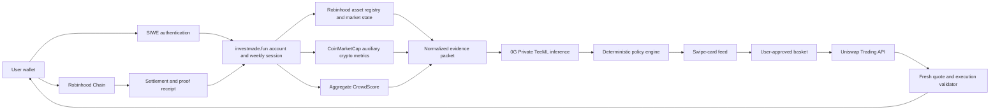
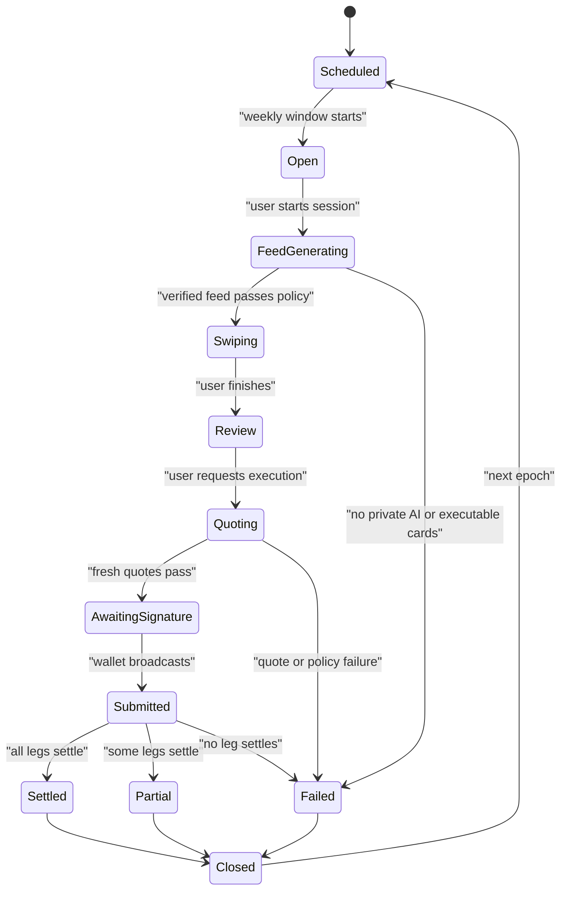

# investmade.fun

> **Private Market Pulse — a private AI-generated stocks and crypto feed with user-controlled execution**

**Document status:** historical hackathon product and implementation brief with a current-state overlay
**Research date:** 25 July 2026
**Event:** [ETHGlobal Lisbon 2026 prize and resource hub](https://ethglobal.com/events/lisbon2026/prizes)
**Build assumption:** two people, roughly 20 focused build hours, Classic/from-scratch submission, and no more than three partner submissions

> **Current implementation notice (26 July 2026):** this long-form document preserves research,
> sponsor options, and rejected/future designs. It is not a line-by-line description of the current
> app. Use [README.md](./README.md), [docs/USER_FLOW.md](./docs/USER_FLOW.md), and
> [docs/ARCHITECTURE.md](./docs/ARCHITECTURE.md) for runtime truth. In particular, the current code
> uses Privy rather than SIWE as its authentication boundary, has no autonomous-mandate endpoint,
> has no separate stock-eligibility service, uses configurable
> period/ticket amounts, executes live buys atomically through the Investmade smart wallet, and
> executes position exits sequentially through the connected wallet.

---

## 1. Executive summary

investmade.fun turns a fixed weekly investing budget into a short, Tinder-like decision session.

A user holds a period budget such as **100 USDG** in the connected wallet, chooses a daily, weekly, or monthly cadence and a per-card ticket size, and receives a bounded private AI-generated asset feed. Each right swipe allocates the selected ticket size to that asset; each left swipe skips it. At the end, the user reviews the basket and confirms execution through the Uniswap Trading API on Robinhood Chain.

The core MVP is non-custodial: the USDG remains in the user’s wallet until the user authorizes execution. “Top up” therefore means funding the connected Robinhood Chain wallet, not depositing into a investmade.fun-controlled account or contract.

The feed changes with market conditions:

- In a crypto-bullish regime, the feed contains more executable crypto assets.
- In a crypto-bearish regime, the feed contains more eligible tokenized stocks and stablecoin-preserving choices.
- Existing portfolio positions, recent price movement, live liquidity, and aggregate crowd preferences can influence card ranking.
- The model explains why each card appears, but deterministic application rules—not the model—enforce budgets, asset eligibility, quote freshness, slippage, and execution limits.

The implemented product is **user-confirmed**, not autonomous:

1. The user answers five plan questions.
2. Privy authenticates the user and activates the canonical Investmade smart wallet.
3. investmade.fun opens a daily, weekly, or monthly cadence session.
4. 0G privately ranks a bounded executable candidate set in production.
5. The user skips/adds cards and reviews the basket.
6. Uniswap returns fresh approvals, Permit2 calls, and exact-input swap calldata.
7. The Investmade smart wallet preflights and submits one atomic buy operation after one user confirmation.
8. investmade.fun reconciles the exact USDG spend and output transfers before showing terminal settlement.

Degen mode affects ranking and community-asset discovery only; it never grants execution authority.

### Recommended partner submissions

| Priority | Partner track | Why it is load-bearing | First-place prize shown |
|---:|---|---|---:|
| 1 | [Uniswap Foundation — Best Uniswap API Integration](https://ethglobal.com/events/lisbon2026/prizes/uniswap-foundation) | Every accepted allocation is routed and settled through live Uniswap paths | $4,000 |
| 2 | [0G — Best AI Product on 0G](https://ethglobal.com/events/lisbon2026/prizes/0g) | Every personalized weekly feed is generated through private, verifiable 0G inference | $3,000 |

The nominal first-place ceiling is **$7,000**, but prize stacking is not guaranteed and should be confirmed with sponsor mentors.

[The Graph — Best AI Use Case](https://ethglobal.com/events/lisbon2026/prizes/the-graph) is the strongest optional third partner when its live data path is genuinely load-bearing.

---

## 2. What investmade.fun is—and is not

### Product definition

investmade.fun is a **gamified fixed-budget weekly allocation product**:

- The cadence and maximum spend are fixed.
- The user controls every accepted card.
- The asset mix can change from week to week.
- Execution is constrained to live, eligible, quoted assets.
- The user can always open an exit workflow; actual settlement depends on permissions, liquidity, and live quotes.

### Honest naming

Classic dollar-cost averaging normally buys the same asset on a fixed schedule. investmade.fun fixes the schedule and budget but lets the asset composition vary. The most accurate product language is:

> “A gamified, fixed-budget weekly DCA and allocation ritual.”

Do not describe it as a passive index or guaranteed DCA strategy.

### It is not

- An investment adviser or a promise of profit.
- A broker or order book.
- A guarantee that every token in a registry has executable liquidity.
- Fully autonomous in the core MVP.
- A product in which 0G’s TEE proves that an investment recommendation is good.
- A product that gives legal ownership of underlying public-company shares.

---

## 3. Essential corrections to the original concept

These corrections materially affect the implementation.

### 3.1 Use USDG on Robinhood Chain

Robinhood Chain’s documented stablecoin is **USDG**, not canonical USDC. The UI can still say “$100 weekly budget,” but the onchain budget for the first MVP should be:

```text
100 USDG = 100,000,000 base units
10 USDG  =  10,000,000 base units
USDG decimals = 6
```

Official Robinhood Chain contract:

```text
USDG: 0x5fc5360D0400a0Fd4f2af552ADD042D716F1d168
```

Source: [Robinhood Chain contracts](https://docs.robinhood.com/chain/contracts/)

USDC bridging or conversion is out of scope unless an exact live route is verified.

### 3.2 Canonical Robinhood Chain assets

Use the canonical Robinhood symbols and contract registry. Do not use invented names such as
`AAPLX`, `APPLEX`, `TSLAX`, or `TESLAX`. The current candidate universe contains WETH, Uniswap’s
Robinhood stock-token list, and opt-in Degen community assets. Discovery returns pages of up to ten
unique executable candidates rather than a fixed ten-token feed. Every live card’s displayed unit
price is derived from its exact USDG-to-asset Uniswap quote.

Live registry examples checked on 25 July 2026:

| Asset | Contract | Decimals |
|---|---|---:|
| AAPL stock token | `0xaF3D76f1834A1d425780943C99Ea8A608f8a93f9` | 18 |
| TSLA stock token | `0x322F0929c4625eD5bAd873c95208D54E1c003b2d` | 18 |
| WETH | `0x0Bd7D308f8E1639FAb988df18A8011f41EAcAD73` | 18 |
| USDG | `0x5fc5360D0400a0Fd4f2af552ADD042D716F1d168` | 6 |

Sources: [Robinhood Stock Token APIs](https://docs.robinhood.com/chain/stock-token-apis/) and [Robinhood Chain contracts](https://docs.robinhood.com/chain/contracts/).

### 3.3 A token list is not an execution list

investmade.fun must build cards from this intersection:

```text
canonical asset registry
∩ token permission checks
∩ healthy market/oracle state
∩ live exact-size Uniswap quote
∩ deterministic risk rules
```

An address in a token list does not prove that a 10 USDG route exists.

### 3.4 One confirmation is one atomic Investmade Wallet operation

The implemented buy path uses a Privy embedded signer controlling a canonical ERC-4337 Investmade
Wallet on Robinhood Chain. The app orders approval reset/approval, Permit2, and every Uniswap swap
inside one smart-account call array. Privy prepares the complete user operation before showing one
confirmation. If any call reverts, the complete basket reverts.

Standard-EOA sequential execution is deliberately not a live-buy fallback. External wallets such as
Rainbow can authenticate and fund the Investmade Wallet, but they do not execute independent basket
legs.

### 3.5 Privy is the authentication boundary

The current code authenticates with a short-lived Privy access token and verifies that the canonical
Investmade smart-wallet address belongs to that Privy user.

---

## 4. Product principles

1. **Fixed downside boundary:** each daily, weekly, or monthly cadence session has a user-selected maximum spend.
2. **User control by default:** the user makes the final allocation and signs execution.
3. **AI proposes, code constrains:** the model ranks only supplied candidates; it never invents token addresses or calldata.
4. **Executable cards only:** every visible buy card has recently passed a live quote gate.
5. **Private personalization:** private portfolio/preferences go through 0G Private/TeeML inference, not a conventional public model endpoint.
6. **Proof over claims:** expose sanitized 0G, Uniswap, and chain receipts.
7. **Privacy-aware community data:** aggregate crowd data without exposing user identifiers.
8. **Exit is always available:** session restrictions may block new buys, but never block a supported-position exit.
9. **Fail closed:** stale, halted, unverified, over-budget, or unquotable plans cannot execute.
10. **No fake sponsor paths:** sponsor-critical data and transactions must be live in the demo.

---

## 5. Core user flow

The implemented flow is:

1. Answer cadence, period-limit, ticket-size, risk, and asset-mix questions.
2. Accept the disclosure and connect with Privy.
3. Create/activate the embedded signer and Investmade smart wallet on chain `4663`.
4. Open a cadence-bound session and request an executable feed page.
5. Skip/add cards without moving funds; paginate while preserving selected assets.
6. Review the basket and refresh every selected route.
7. Preflight and sign one atomic smart-wallet buy operation.
8. Reconcile the submitted receipt and exact output transfers.
9. View Activity/Portfolio, or prepare fresh sequential wallet-confirmed exits.

The authoritative screen-by-screen version is [docs/USER_FLOW.md](./docs/USER_FLOW.md).

> The detailed subsections below preserve the original hackathon design. Fixed `100/10 USDG`,
> fixed CrowdScore, SIWE, and atomic Sell All statements are historical unless
> they also appear in the current user-flow document.

### 5.1 Historical onboarding design

1. User selects an investment frequency: every day, every week, or every month.
2. User selects a ticket size: 2 USDG, 10 USDG, 25 USDG, or another whole USDG amount from 1 to 100.
3. User selects a risk mode: conservative, balanced, or degen.
4. User selects crypto, tokenized stocks, or both.
5. User acknowledges that AI output is a ranking rather than financial advice, assets can lose
   value, stock tokens depend on eligibility, and every trade requires wallet approval.
6. User authenticates with Privy; Privy creates an embedded signer and the canonical Investmade smart wallet.
7. Backend verifies the Privy access token and confirms the Investmade smart wallet belongs to that user.
8. App activates a Privy smart-wallet client for Robinhood Chain.
9. App checks:
   - USDG balance;
   - smart-wallet activation and bundler/paymaster readiness;
   - existing Permit2 approval state.

The first-time answers are a versioned, minimal client preference record and are submitted to the
backend when generating a feed. Cadence determines the idempotent session epoch; ticket size
determines exact quote and allocation amounts; allowed asset classes filter the deterministic
candidate set before private inference.

### 5.2 Historical investment-plan design

The user selects:

- Cadence: daily, weekly, or monthly.
- Period budget limit: 100 USDG.
- Ticket size: 2 USDG, 10 USDG, 25 USDG, or a whole custom amount from 1 to 100 USDG.
- Maximum cards: the lower of ten or `floor(period budget / ticket size)`.
- Risk mode: conservative, balanced, or degen.
- Allowed asset classes: crypto, tokenized stocks, or both.
- Slippage ceiling.

The backend derives:

```text
maximum accepted cards = min(10, floor(period budget / ticket size))
```

The feed contains at most one card per unique asset. Ten is a capacity maximum, not a promise that ten distinct executable assets will always exist. If only three candidates pass the live gates, show three cards and keep the unallocated USDG in the wallet.

For the demo:

```text
weekly budget = 100 USDG
card size = 10 USDG
maximum accepted cards = 10
```

Unspent slots remain USDG.

### 5.3 Historical weekly-session design

When the weekly window opens:

1. The session becomes available for a bounded time.
2. Backend loads the canonical asset registry.
3. It removes restricted, halted, paused, stale, and user-excluded assets.
4. It checks exact 10 USDG Uniswap quote availability.
5. It builds a normalized market-evidence packet.
6. It sends only the bounded candidate packet and necessary private preferences to 0G.
7. 0G returns a strict JSON ranking.
8. Deterministic policy validates and caps the response.
9. The frontend receives ordered cards and a sanitized proof receipt.

The user cannot start a second session for the same epoch.

### 5.4 Historical swipe design

Each card shows:

- Asset name and class.
- 10 USDG allocation.
- Current executable quote preview.
- AI reason in one sentence.
- Market-regime evidence.
- Aggregate CrowdScore.
- Liquidity and price-impact warning.
- Data timestamp.
- “Why am I seeing this?” details.

Actions:

- **Swipe right:** reserve one 10 USDG slot for the asset.
- **Swipe left:** skip the asset.
- **Undo:** optional before review.
- **Stop:** end early and keep remaining USDG.

The swipe itself does not move funds.

### 5.5 Historical review and execution design

The review screen displays:

- Selected assets and exact input per asset.
- Total USDG spend.
- Estimated output and minimum output.
- Price impact, fees, gas, and quote expiry.
- Unspent USDG.
- 0G TEE verification state.
- Warnings and deterministic policy result.

Immediately before signing:

1. Re-fetch every quote.
2. Re-run all eligibility and policy checks.
3. Recalculate the total.
4. Discard stale Permit2 messages and old calldata.
5. Build the best wallet-compatible execution path.

Execution modes:

| Mode | User experience | MVP status |
|---|---|---|
| Privy ERC-4337 Investmade Wallet | One preflighted operation containing every approval, Permit2, and swap call | Implemented buy path |
| Standard EOA / external wallet | Authentication and funding only; never sequential basket execution | Supported account role |
| EIP-7702/compatible delegation | Possible future direct-external-wallet path | Stretch |

After broadcast, investmade.fun waits for terminal chain/order status. An API response or transaction hash alone is not settlement proof.

### 5.6 Historical between-session design

New investmade.fun buys are disabled between sessions. The user can still:

- View positions and receipts.
- View the next-session countdown.
- Change settings for the next epoch.
- Revoke approvals or an autonomous mandate.
- Exit any supported position to USDG.
- Use **Sell All to USDG** only after every displayed leg passes a fresh exit quote.

This is an application rule, not a claim that tokens are technically non-transferable outside investmade.fun.

### 5.7 Historical exit and Sell All design

The core MVP always exposes **Exit position** for each supported holding. The workflow is always reachable, but settlement is best-effort and can be blocked by permissioning, halts, transfer restrictions, or liquidity. **Sell All** is enabled only when every non-dust position has a valid exit path.

1. Read current supported balances.
2. Remove dust and unsupported assets.
3. Run `/permissions` for each tokenized asset.
4. Run `/check_approval` for each position token and submit required approvals.
5. Request a fresh exact-input quote for each position to USDG and sign any fresh Permit2 payload.
6. Show expected USDG, minimum output, price impact, and gas.
7. Require a wallet confirmation.
8. For one position, broadcast the single exit; for Sell All, use the best available batch/multi-transaction path.
9. Record each leg as settled, failed, or skipped.

Never label a partial exit “Sell All complete.”

---

## 6. Historical proposed architecture

This section is the pre-build architecture proposal. The implemented architecture is documented in
[docs/ARCHITECTURE.md](./docs/ARCHITECTURE.md).



### Components

| Component | Suggested implementation | Responsibility |
|---|---|---|
| Web app | Next.js, React, TypeScript | Onboarding, cards, review, receipts |
| Wallet | wagmi + viem | SIWE, chain reads, signatures, broadcasting |
| Backend API | Node.js + TypeScript | Keys, sessions, sponsor APIs, policy |
| Database | PostgreSQL | Accounts, sessions, swipes, idempotency, receipts |
| Private AI | 0G Compute Router | Structured personalized feed generation |
| Market/execution | Uniswap Trading API | Approvals, quotes, calldata/orders, status |
| Execution chain | Robinhood Chain | USDG, crypto and stock-token settlement |
| Market metadata | Robinhood REST + RPC | Canonical assets, prices, halt/oracle state |
| Auxiliary crypto data | CoinMarketCap | Rank, volume, momentum |
| Optional live onchain data | The Graph | Liquidity/flows/portfolio signal fallback track |

All sponsor and RPC keys remain server-side.

---

## 7. Historical proposed session state machine

The current buy path submits one atomic operation and therefore normally reaches `SETTLED` or
`FAILED`; `PARTIAL` remains only for legacy/non-atomic records. Demo and local-live sessions are
nonce-suffixed and repeatable, while production uses the cadence epoch as the persistent boundary.



Database guarantees:

- Unique `(user_id, epoch_id)` session.
- Unique `(user_id, epoch_id, execution_nonce)`.
- At-most-one successful weekly execution.
- Idempotent webhook/status updates.
- No state transition from `CLOSED` back to an executable state.

Position exits use a separate workflow and do not depend on the weekly buy state machine. Sell All is enabled only when every leg is currently executable.

---

## 8. Robinhood Chain and tokenized stocks

### 8.1 Network configuration

| Field | Mainnet value |
|---|---|
| Chain ID | `4663` |
| CAIP-2 | `eip155:4663` |
| Native gas token | ETH |
| Public RPC | `https://rpc.mainnet.chain.robinhood.com` |
| Stablecoin | USDG |

Robinhood Chain is an EVM-compatible Arbitrum L2. Sources: [About Robinhood Chain](https://docs.robinhood.com/chain/) and [Connecting to Robinhood Chain](https://docs.robinhood.com/chain/connecting/).

### 8.2 Asset discovery

Use Robinhood’s canonical APIs:

```text
GET /rhj/assets
GET /rhj/prices/{symbol}
GET /rhj/corporate-actions
```

The documented rate limit is 60 requests per second, and price responses are cached for roughly 15 seconds.

The registry supplies identity and market state. It does not replace an executable Uniswap quote.

### 8.3 Stock-token semantics

Robinhood Stock Tokens:

- Are ERC-20 tokens with 18 decimals.
- Use the ERC-8056 UI multiplier mechanism.
- Represent tokenized debt securities providing economic exposure.
- Do not give direct legal or beneficial ownership of the underlying shares.
- Can be subject to jurisdiction, distribution, and transfer restrictions.

Sources: [Stock Tokens overview](https://docs.robinhood.com/chain/stock-tokens/) and [Building with Stock Tokens](https://docs.robinhood.com/chain/building-with-stock-tokens/).

The UI must say “AAPL stock token” or “tokenized AAPL exposure,” not “Apple shares.”

### 8.4 Price and safety semantics

Before a stock card is eligible:

1. `status` is active.
2. `isTradingHalt` is false.
3. `oraclePaused()` is false.
4. Oracle answer is positive.
5. Oracle update is not stale for the current market session.
6. Corporate-action state is understood.
7. User eligibility passes.
8. Exact-size Uniswap quote passes.

Robinhood’s REST bid/ask represents the underlying-equity price and must be adjusted by the current multiplier when a token-equivalent display value is needed.

Robinhood’s Chainlink feed already incorporates the multiplier. Do **not** multiply the onchain feed value again.

Stock price feeds operate 24/5, so weekend freshness rules must account for the market session.

Source: [Robinhood oracles and price feeds](https://docs.robinhood.com/chain/oracles-and-price-feeds/).

### 8.5 Legal and eligibility boundary

Robinhood documentation describes geographic restrictions, including restrictions involving the United States, United Kingdom, and other jurisdictions. A hackathon demo should:

- Use synthetic test users.
- Show an explicit eligibility gate.
- Avoid claiming legal availability to all users.
- Keep tokenized-stock mode disabled when eligibility is unknown.

Source: [Robinhood Chain Terms of Service](https://docs.robinhood.com/chain/terms-of-service/).

---

## 9. Market signal and card-ranking pipeline

### 9.1 Source separation

| Source | What it may provide | What it must not be called |
|---|---|---|
| Robinhood APIs/RPC | Stock identity, underlying price, multiplier, halt, oracle state | Executable DEX quote |
| Uniswap | Executable route, output, price impact, routing, status | Long-horizon sentiment |
| CoinMarketCap | Crypto rank, price, market cap, 24h volume, momentum | Genuine social sentiment |
| investmade.fun CrowdScore | Aggregate account-scoped swipes | Market price or liquidity |
| The Graph, optional | Onchain swaps, liquidity events, token flows, balances | X/Reddit/CMC data |
| 0G | Personalized ranking and explanation over supplied data | Asset registry or authority to trade |

### 9.2 Minimal market-regime features

For the MVP:

```text
cryptoMomentum =
  weighted BTC/ETH 7d and 24h returns

cryptoBreadth =
  percentage of allowlisted crypto assets with positive 7d return

cryptoVolumeImpulse =
  current 24h volume / trailing reference volume

stockAvailability =
  percentage of eligible stock tokens with healthy state and live quotes

portfolioDrift =
  current asset-class weight - user target/risk preference

crowdPreference =
  eligible right swipes / eligible total swipes
```

The AI can classify a regime such as:

- `CRYPTO_BULLISH`
- `CRYPTO_NEUTRAL`
- `CRYPTO_BEARISH`
- `RISK_OFF`

The classification is a feed-composition input, not a guaranteed prediction.

### 9.3 CrowdScore

To produce a genuine network effect:

- Count at most one vote per authenticated account per asset per weekly epoch.
- Derive an internal pseudonym from the authenticated account ID with a server-side secret.
- Store only the pseudonymous internal identifier.
- Publish only aggregates after a minimum cohort threshold.
- Do not show exact counts for tiny cohorts.
- Separate right-swipe rate from execution rate.
- Exclude bots and duplicate sessions.
- Mark the score as “investmade.fun community preference,” not market-wide sentiment.

Example:

```json
{
  "assetId": "rh:4663:AAPL",
  "epochId": "W:2026-W31",
  "rightSwipes": 37,
  "totalSwipes": 64,
  "scoreBps": 5781,
  "cohortThresholdPassed": true
}
```

### 9.4 Candidate gate

The backend—not the model—constructs candidates:

```text
for each canonical asset:
  reject if not on allowlist
  reject if user excluded
  reject if halted, paused, or stale
  request exact-card-size Uniswap quote
  reject if no route
  reject if price impact > configured limit
  retain normalized evidence and quote timestamp
```

Only retained candidates enter the 0G prompt.

### 9.5 AI ranking

0G receives:

- Candidate assets and normalized evidence.
- Current portfolio weights.
- User cadence, ticket size, risk preference, and allowed asset classes.
- Period budget limit and derived card capacity.
- Market-regime features.
- CrowdScore aggregates.
- Policy version.

It returns:

- Target crypto/stock/stable mix.
- Ranked asset cards.
- Per-card explanation and evidence IDs.
- Optional informational exit/rebalance warnings for existing holdings.
- Warnings and confidence.

The model cannot add a new contract address.

The core swipe feed contains buy cards only. Executable sell cards are a stretch feature because they need an explicit sell size, position-token approval, reverse quote, and separate review semantics. Until then, an exit warning links to the independent position-exit workflow.

### 9.6 Deterministic post-AI policy

Reject or modify the model output if:

- Schema is invalid.
- Input commitment does not match.
- Any asset is outside the candidate set.
- A card exceeds 10 USDG.
- Total exceeds the weekly budget.
- There are more than ten accepted-card opportunities.
- A core-MVP card asks for a `SELL` action.
- The source data is stale.
- A stock is ineligible, halted, or oracle-paused.
- A quote is missing or outside slippage/impact limits.
- The weekly session is closed or already executed.

---

## 10. 0G private and verifiable AI integration

### 10.1 Why 0G is load-bearing

Every personalized weekly card feed must be generated through 0G. If the 0G response is unavailable or not privately verified, the personalized session does not open.

Using 0G only to write card descriptions would be decorative and a weaker prize submission.

### 10.2 Recommended route

Use the server-side [0G Compute Router](https://docs.0g.ai/developer-hub/building-on-0g/compute-network/router/overview):

```text
Base URL: https://router-api.0g.ai/v1
Endpoint: POST /chat/completions
Trust mode: private
TEE verification: true
Output: strict JSON
```

Two settings do different jobs:

- `X-0G-Provider-Trust-Mode: private` restricts the request to private TeeML providers.
- `"verify_tee": true` asks the Router to verify the provider’s TEE-signed response.

Never silently downgrade from `private` to `verified` or `standard`.

### 10.3 Live model preflight

Query the live catalog before the demo:

```text
GET https://router-api.0g.ai/v1/models
```

On 25 July 2026, private text-capable mainnet catalog entries included:

- `0gm-1.0-35b-a3b`
- `0gm-1.0-35b-a3b-sia`
- `glm-5.2`

Treat these as a dated observation, not a hard-coded permanent list. The testnet catalog did not expose an equivalent private TeeML text model at research time, so the MVP likely needs a small funded mainnet Router account or sponsor-provided capacity.

Sources: [0G Router models](https://docs.0g.ai/developer-hub/building-on-0g/compute-network/router/models) and [0G Router quickstart](https://docs.0g.ai/developer-hub/building-on-0g/compute-network/router/quickstart).

### 10.4 Request example

```ts
const response = await fetch(
  "https://router-api.0g.ai/v1/chat/completions",
  {
    method: "POST",
    headers: {
      Authorization: `Bearer ${process.env.ZG_ROUTER_API_KEY}`,
      "Content-Type": "application/json",
      "X-0G-Provider-Trust-Mode": "private"
    },
    body: JSON.stringify({
      model: "0gm-1.0-35b-a3b",
      messages: [
        {
          role: "system",
          content:
            "Rank only supplied candidates. Return valid JSON matching schema v1."
        },
        {
          role: "user",
          content: JSON.stringify(feedInput)
        }
      ],
      response_format: { type: "json_object" },
      verify_tee: true,
      temperature: 0.2,
      max_tokens: 2500,
      stream: false
    })
  }
);

const body = await response.json();

if (!response.ok) throw new Error(`0G_HTTP_${response.status}`);
if (body.x_0g_trace?.tee_verified !== true) {
  throw new Error("UNVERIFIED_PRIVATE_INFERENCE");
}

const feed = FeedSchema.parse(
  JSON.parse(body.choices[0].message.content)
);
```

Sources: [Chat Completions](https://docs.0g.ai/developer-hub/building-on-0g/compute-network/router/features/chat-completions) and [Verifiable execution](https://docs.0g.ai/developer-hub/building-on-0g/compute-network/router/features/verifiable-execution).

### 10.5 AI input contract

```json
{
  "schemaVersion": "investmade-feed-input/v1",
  "sessionId": "opaque-session-id",
  "epochId": "2026-W31",
  "policyVersion": "investmade-policy/v1",
  "budget": {
    "token": "USDG",
    "decimals": 6,
    "periodBudgetBaseUnits": "100000000",
    "slotBudgetBaseUnits": "25000000",
    "maxCards": 4
  },
  "preferences": {
    "cadence": "weekly",
    "ticketSizeUsd": 25,
    "riskMode": "balanced",
    "assetClasses": ["CRYPTO", "STOCK_TOKEN"]
  },
  "portfolio": [
    {
      "assetId": "rh:4663:WETH",
      "weightBps": 4200,
      "return7dBps": 730
    }
  ],
  "marketRegimeFeatures": {
    "cryptoMomentumBps": 640,
    "cryptoBreadthBps": 6100,
    "cryptoVolumeImpulseBps": 11800
  },
  "candidates": [
    {
      "assetId": "rh:4663:AAPL",
      "contract": "0xaF3D76f1834A1d425780943C99Ea8A608f8a93f9",
      "kind": "STOCK_TOKEN",
      "quoteAvailable": true,
      "estimatedPriceImpactBps": 38,
      "crowdScoreBps": 5781,
      "evidenceIds": ["rh-price:AAPL:...", "uni-quote:..."]
    }
  ],
  "inputCommitment": "sha256:..."
}
```

Do not send API keys, wallet private keys, or arbitrary unfiltered social content.

### 10.6 AI output contract

```json
{
  "schemaVersion": "investmade-feed-output/v1",
  "sessionId": "opaque-session-id",
  "inputCommitment": "sha256:...",
  "policyVersion": "investmade-policy/v1",
  "regime": "CRYPTO_BULLISH",
  "targetMixBps": {
    "crypto": 6500,
    "stockTokens": 2500,
    "stable": 1000
  },
  "cards": [
    {
      "assetId": "rh:4663:WETH",
      "action": "BUY",
      "rank": 1,
      "maxUsdMinor": 1000,
      "scoreBps": 7420,
      "evidenceIds": ["cmc:eth:...", "crowd:WETH:..."],
      "reason": "Positive crypto breadth and executable low-impact route."
    }
  ],
  "warnings": []
}
```

`maxUsdMinor` is display currency metadata. Execution always uses the exact USDG base-unit amount.

### 10.7 Proof receipt

Expose a sanitized receipt:

```json
{
  "network": "0G mainnet",
  "model": "0gm-1.0-35b-a3b",
  "trustMode": "private",
  "provider": "0x...",
  "requestId": "req-...",
  "teeVerified": true,
  "independentVerification": "NOT_RUN",
  "inputCommitment": "sha256:...",
  "outputCommitment": "sha256:..."
}
```

`independentVerification` is `NOT_RUN`, `PASSED`, or `FAILED`. Router verification is required; independent SDK verification is a stretch. If independent verification is attempted and fails, reject the response.

For stronger verification, capture the sensitive `ZG-Res-Key` response header and call `broker.inference.processResponse(providerAddress, chatId)` from [`@0gfoundation/0g-compute-ts-sdk`](https://github.com/0gfoundation/0g-compute-ts-sdk).

Never publish the chat ID. A provider signature endpoint can use it to retrieve signed response content.

### 10.8 Privacy claim

The accurate claim is:

> “investmade.fun sends minimized personalization data to a private 0G TeeML provider and requires a verified TEE response. 0G documents zero retention for text prompts and completions, while retaining billing metadata.”

investmade.fun’s own backend still sees the structured input unless a separate client-to-enclave encryption design is implemented. Disable body logging, APM payload capture, and prompt/completion persistence.

TEE verification proves where/how the response was processed and signed. It does not prove:

- prediction accuracy;
- profitability;
- the quality of the ranking;
- open-source model weights;
- that a later trade matches the recommendation.

The last property comes from the local policy hash and execution receipt.

Source: [0G privacy and zero-data retention](https://docs.0g.ai/developer-hub/building-on-0g/compute-network/router/privacy).

### 10.9 0G failure policy

| Failure | Behavior |
|---|---|
| `400` malformed request | Fix; do not retry unchanged |
| `401` invalid key | Stop and repair configuration |
| `402` insufficient balance | Fund the Router account |
| `403` invalid scope | Use the correctly scoped key |
| `429` rate limit | Honor `Retry-After` |
| `502` provider error | Bounded retry |
| `503` no private provider | Try another live TeeML model, then stop |
| Missing/false `tee_verified` | Reject |
| Invalid JSON/schema | Reject |
| Commitment mismatch | Reject |

Source: [0G Router errors](https://docs.0g.ai/developer-hub/building-on-0g/compute-network/router/errors).

### 10.10 What can be proved and open-sourced

The integration can prove:

- The request selected `private` trust mode.
- The response named a TeeML provider and model.
- The Router reported `tee_verified: true`.
- Optional independent response verification passed.
- The validated output matched a published schema and commitment.
- The deterministic policy transformed that output into the displayed plan.
- The Uniswap settlement matched the plan’s asset and spend boundaries.

Open-source:

- Redacted system-prompt template.
- Input/output JSON schemas.
- Candidate construction and canonicalization.
- Budget, eligibility, quote, slippage, and replay guards.
- TEE verification and receipt code.
- Policy and prompt versioning.
- Sanitized demo traces.

Keep private:

- Personalized prompt/input and raw completion.
- Portfolio/account identifiers not needed by the public proof.
- 0G `ZG-Res-Key`/chat ID.
- Permit2 signatures and all API/private keys.

This combination lets judges inspect the policy and verification logic without exposing user data.

---

## 11. Uniswap execution integration

### 11.1 Why Uniswap is load-bearing

Uniswap is responsible for:

- Checking spend approval.
- Producing exact-size live quotes.
- Selecting AMM or UniswapX routing.
- Returning validated calldata or an order payload.
- Returning swap/order status inputs.

A card is not executable until Uniswap returns a valid quote.

### 11.2 Robinhood Chain support

The Uniswap Trading API lists Robinhood Chain:

```text
chainId: 4663
Universal Router 2.1.1:
0x8876789976decbfcbbbe364623c63652db8c0904
UniswapX V3: supported
```

Set this header consistently:

```http
x-universal-router-version: 2.1.1
```

Robinhood Chain has no Universal Router 2.0 deployment. Source: [Uniswap supported chains and tokens](https://developers.uniswap.org/docs/trading/swapping-api/supported-chains).

Use the [Uniswap verified token list](https://tokens.uniswap.org) as an additional candidate source, but still resolve by chain ID and address—not symbol—and still require live permission and quote gates. Symbols such as `USDC`, `WBTC`, and `1INCH` can be spoofed by unrelated contracts.

#### Permission gate for tokenized pools

Before quoting a stock token, call:

```http
POST https://trade-api.gateway.uniswap.org/v1/permissions
```

```json
{
  "walletAddress": "0xUSER",
  "tokens": [
    "0xaF3D76f1834A1d425780943C99Ea8A608f8a93f9"
  ],
  "chainId": 4663
}
```

The endpoint accepts at most two token addresses per request.

- `isPermissioned: false` — proceed normally.
- `isPermissioned: true` and `isAllowlisted: true` — proceed.
- `isPermissioned: true` and `isAllowlisted: false` — block submission and show the returned `issuer` and `kycUrl`.

Permissioned-token swaps require Universal Router 2.2.0 or newer, while the current Robinhood supported-chain table lists only 2.1.1. This is an explicit kill test: reject the card unless a live API test and sponsor guidance confirm a supported permissioned route.

Source: [Swapping on tokenized pools](https://developers.uniswap.org/docs/trading/swapping-api/swapping-tokenized-pools).

### 11.3 Exact API flow

Base URL:

```text
https://trade-api.gateway.uniswap.org/v1
```

Flow:

1. Combine repeated swipes for the same asset into one leg.
2. Read wallet balance through RPC.
3. `POST /permissions` for each stock-token pair.
4. `POST /check_approval` for the total required USDG.
5. Submit approval transaction when required.
6. Immediately before confirmation, call `POST /quote` once per distinct leg.
7. If `permitData` exists, ask the wallet to sign it.
8. For `CLASSIC`, `WRAP`, `UNWRAP`, or `BRIDGE`, call `POST /swap` or the compatible batching endpoint.
9. For `DUTCH_V2`, `DUTCH_V3`, or `PRIORITY`, call `POST /order`.
10. For `CHAINED`, use the documented `/plan` state machine or reject it from the MVP.
11. Wallet signs/broadcasts or submits the order.
12. Monitor terminal AMM status through `/swaps` and UniswapX status through `/orders`.
13. Reconcile exact settled input/output.

Sources:

- [Swapping API integration guide](https://developers.uniswap.org/docs/trading/swapping-api/integration-guide)
- [Check swap approvals](https://developers.uniswap.org/docs/api-reference/check_approval)
- [Get a quote](https://developers.uniswap.org/docs/api-reference/aggregator_quote)
- [Create swap calldata](https://developers.uniswap.org/docs/api-reference/create_swap_transaction)
- [Create a gasless order](https://developers.uniswap.org/docs/api-reference/post_order)

### 11.4 Quote request

Illustrative exact-input request:

```json
{
  "type": "EXACT_INPUT",
  "tokenIn": "0x5fc5360D0400a0Fd4f2af552ADD042D716F1d168",
  "tokenOut": "0xaF3D76f1834A1d425780943C99Ea8A608f8a93f9",
  "tokenInChainId": 4663,
  "tokenOutChainId": 4663,
  "amount": "10000000",
  "swapper": "0xUSER",
  "slippageTolerance": 0.5,
  "routingPreference": "BEST_PRICE",
  "permitAmount": "EXACT"
}
```

Notes:

- All amounts are integer base units.
- `10 USDG` is `10_000_000`.
- Omit an explicit UniswapX-only `protocols` filter so AMM routing remains available.
- `slippageTolerance` is a percentage, so `0.5` means 0.5%, or 50 basis points.
- The final slippage limit should be product-configured and policy-capped.
- Use `permitAmount: EXACT` for a bounded weekly spend.

### 11.5 The 10 USDG liquidity risk

UniswapX generally requires a minimum 300 USDC-equivalent swap. Below that threshold it is considered only if it improves the AMM route by at least 0.2%.

Therefore:

- A 10 USDG stock-token swap likely depends on an AMM route.
- Every intended card must pass an exact 10 USDG quote test.
- If a route fails, the asset must not appear.
- If most stock routes fail, increase the card size or reduce stock coverage.

This is the single most important commercial-feasibility kill test.

### 11.6 Permit2 rules

The Permit2 flow can require:

1. An onchain approval to Permit2.
2. An offchain EIP-712 Permit2 signature.
3. The swap transaction.

Important rules:

- A Permit2 signature is tied to its quote.
- Never reuse it after fetching a new quote.
- Request a fresh quote immediately before signing.
- Forward the signature exactly as expected.
- Never modify API-returned calldata.
- Prefer an exact, time-limited spend boundary.

Source: [Uniswap Permit2 approval](https://developers.uniswap.org/docs/trading/swapping-api/concepts/permit2).

### 11.7 One-confirmation strategy

Implemented order:

1. Create a Privy embedded signer and canonical ERC-4337 Investmade Wallet.
2. Request each AMM quote with `generatePermitAsTransaction: true`.
3. Order approval reset/approval, deduplicated Permit2 transactions, and swap calldata.
4. Call `prepareUserOperation({ calls })` for a full-batch preflight.
5. Call `sendTransaction({ calls })` once and persist the resulting operation transaction hash.
6. Block execution if the smart-wallet client, preflight, balance, or fresh quote is unavailable.
5. Sign and broadcast the returned encoded transaction.

This does not merge asynchronous UniswapX orders. If any leg routes to `DUTCH_V2`, `DUTCH_V3`, or `PRIORITY`, do not claim a one-transaction basket.

Further stretch:

- Robinhood Chain ERC-4337 smart account with `executeBatch`.
- Sponsored gas or session keys.

Source: [Robinhood account abstraction](https://docs.robinhood.com/chain/account-abstraction/).

Do not promise atomicity unless the chosen wallet/account path proves all legs revert or settle together.

### 11.8 Execution receipt

```json
{
  "sessionId": "opaque-session-id",
  "epochId": "2026-W31",
  "chainId": 4663,
  "inputToken": "0x5fc5...",
  "executionMode": "EIP_5792",
  "legs": [
    {
      "assetId": "rh:4663:AAPL",
      "amountInBaseUnits": "10000000",
      "quoteRequestId": "req-...",
      "routing": "CLASSIC",
      "minimumAmountOut": "...",
      "transactionHash": "0x...",
      "status": "SETTLED",
      "settledAmountOut": "..."
    }
  ],
  "totalInputBaseUnits": "10000000",
  "maxSlippageBps": 50,
  "authorizationExpiresAt": 1784970600,
  "authorizedPlanHash": "sha256:...",
  "policyHash": "sha256:...",
  "blockNumber": 123456,
  "outcome": "SETTLED"
}
```

An HTTP 200, quote ID, order acknowledgement, or transaction hash is not enough. Show terminal status and actual settled amounts.

---

## 13. Optional The Graph integration

### 13.1 When to use it

Use The Graph only if it is implemented without risking the core demo.

Target:

> [Best AI Use Case of The Graph](https://ethglobal.com/events/lisbon2026/prizes/the-graph)

Do not target “AI Tooling” unless investmade.fun builds reusable Graph infrastructure. Do not target a composability category without using the required number/type of Graph products.

### 13.2 Load-bearing story

The Graph supplies a live market snapshot:

- Onchain AMM swap volume.
- Swap count and recent activity.
- Liquidity additions/removals.
- ERC-20 flows.
- Stock-token multiplier events.
- Portfolio balances.
- Indexed-block provenance.

0G must materially change card rankings or asset-class weights when these live fields change.

Do not claim The Graph supplies X sentiment, CoinMarketCap data, Robinhood REST prices, or a pre-trade Uniswap API quote.

### 13.3 Robinhood indexing feasibility

The Graph documents Robinhood Chain as network `robinhood`, chain ID `4663`:

- [Supported Robinhood network](https://thegraph.com/docs/en/supported-networks/robinhood/)
- [Substreams Robinhood endpoint](https://substreams.dev/chain/robinhood)

Research on 25 July 2026 found no ready-made public Robinhood subgraph. The practical sequence is:

1. Run a 45-minute Subgraph Studio kill test with one known AAPL `Transfer` handler.
2. Pass only if `_meta.block.number` advances and `hasIndexingErrors` is false.
3. If it fails, use the confirmed Robinhood Substreams/Firehose endpoint.
4. If that is too costly, use a mature Uniswap subgraph on another chain for a crypto-regime signal and label the weaker relationship honestly.

Suggested Substreams endpoint:

```text
robinhood.substreams.pinax.network:443
```

### 13.4 Minimal entities

```graphql
type Asset @entity {
  id: ID!
  symbol: String!
  kind: String!
  uiMultiplier: BigInt
  oraclePaused: Boolean!
  latestOracleAnswer: BigInt
  latestOracleUpdatedAt: BigInt
  transferCount: BigInt!
  swapCount: BigInt!
}

type Swap @entity(immutable: true) {
  id: Bytes!
  asset: Asset!
  amountIn: BigInt!
  amountOut: BigInt!
  transactionHash: Bytes!
  blockNumber: BigInt!
  timestamp: BigInt!
}

type WalletPosition @entity {
  id: ID!
  wallet: Bytes!
  asset: Asset!
  rawBalance: BigInt!
  lastUpdatedBlock: BigInt!
}
```

Use `_meta` in every query:

```graphql
_meta {
  block {
    number
    hash
    timestamp
  }
  deployment
  hasIndexingErrors
}
```

Sources:

- [Subgraph quick start](https://thegraph.com/docs/en/subgraphs/quick-start/)
- [Substreams quick start](https://thegraph.com/docs/en/substreams/quick-start/)
- [The Graph GraphQL API](https://thegraph.com/docs/en/subgraphs/querying/graphql-api/)

### 13.5 Honest limitations

- A new subgraph may not have enough history for reliable 30-day volatility.
- Transfer count is not trading volume.
- Robinhood REST daily volume is underlying-equity volume, not token DEX volume.
- Only decoded swaps should be labeled onchain trade volume.
- The Graph cannot fetch arbitrary HTTP social data inside a normal subgraph.
- A Subgraph Studio deployment is not “live” for judging until indexing advances.

---

## 14. Data contracts

### 14.1 User settings

```json
{
  "userRef": "internal-pseudonym",
  "wallet": "0x...",
  "chainId": 4663,
  "cadence": "weekly",
  "stableToken": {
    "symbol": "USDG",
    "address": "0x5fc5360D0400a0Fd4f2af552ADD042D716F1d168",
    "decimals": 6
  },
  "periodBudgetBaseUnits": "100000000",
  "ticketSizeUsd": 25,
  "slotBudgetBaseUnits": "25000000",
  "maxCards": 4,
  "riskMode": "balanced",
  "stockTokensEnabled": true,
  "autonomousMode": false,
  "maxSlippageBps": 50
}
```

### 14.2 Market evidence

```json
{
  "assetId": "rh:4663:AAPL",
  "kind": "STOCK_TOKEN",
  "contract": "0xaF3D76f1834A1d425780943C99Ea8A608f8a93f9",
  "decimals": 18,
  "sources": {
    "registry": "robinhood",
    "quote": "uniswap",
    "crowd": "investmade.fun"
  },
  "market": {
    "price": "...",
    "return24hBps": 32,
    "return7dBps": 181,
    "crowdScoreBps": 5781
  },
  "safety": {
    "status": "ACTIVE",
    "tradingHalt": false,
    "oraclePaused": false,
    "oracleUpdatedAt": "2026-07-25T12:00:00Z",
    "quoteAvailable": true,
    "estimatedPriceImpactBps": 38
  },
  "evidenceIds": ["rh:...", "uni:...", "crowd:..."]
}
```

### 14.3 Trade plan

```json
{
  "sessionId": "opaque-session-id",
  "chainId": 4663,
  "inputToken": "0x5fc5360D0400a0Fd4f2af552ADD042D716F1d168",
  "inputDecimals": 6,
  "trades": [
    {
      "assetId": "rh:4663:AAPL",
      "tokenOut": "0xaF3D76f1834A1d425780943C99Ea8A608f8a93f9",
      "amountInBaseUnits": "10000000",
      "quoteRequestId": "req-...",
      "routing": "CLASSIC",
      "minimumAmountOut": "...",
      "deadline": 1784970300
    }
  ],
  "totalInputBaseUnits": "10000000",
  "authorizedPlanHash": "sha256:...",
  "policyHash": "sha256:...",
  "generatedAt": "2026-07-25T12:00:00Z"
}
```

`authorizedPlanHash` covers a versioned, canonical, route-independent intent: session/epoch, chain, input token, output-token addresses, exact input amounts, total, slippage cap, and expiry. Quote IDs, `minimumAmountOut`, route, gas, and transaction deadlines are excluded because they must be refreshed. The execution builder verifies that every fresh quote preserves the authorized intent before attaching the receipt.

### 14.4 Unified proof receipt

```json
{
  "sessionId": "opaque-session-id",
  "epochId": "2026-W31",
  "authorizedPlanHash": "sha256:...",
  "zeroG": {
    "model": "0gm-1.0-35b-a3b",
    "provider": "0x...",
    "requestId": "req-...",
    "teeVerified": true,
    "independentVerification": "NOT_RUN",
    "outputCommitment": "sha256:..."
  },
  "uniswap": {
    "quoteRequestIds": ["req-..."],
    "transactionHashes": ["0x..."],
    "terminalOutcome": "SETTLED"
  },
  "chain": {
    "chainId": 4663,
    "blockNumber": 123456
  },
  "policyHash": "sha256:..."
}
```

Do not include the 0G chat ID in a public receipt.

---

## 15. Safety, privacy, and integrity

### 15.1 Trust boundaries

| Boundary | Risk | Control |
|---|---|---|
| Browser → backend | Forged session/input | SIWE, CSRF protection, schema validation |
| Backend → 0G | Private preference leakage | Data minimization, no body logs, private trust mode |
| 0G output → policy | Hallucinated assets or amounts | Candidate IDs only, strict schema, deterministic caps |
| Backend → Uniswap | Stale or manipulated quote | Fresh quote, request IDs, allowlist, slippage cap |
| Wallet → chain | Wrong chain/transaction | Chain ID check, display summary, calldata untouched |
| Crowd aggregation | Sybil/privacy attack | Account-scoped pseudonym, epoch limit, cohort threshold |

### 15.2 Required security rules

- Never ship 0G, Uniswap, or Robinhood partner keys to the browser.
- Never log wallet signatures, 0G prompts/completions, or Permit2 signatures.
- Validate addresses against the canonical candidate map.
- Use checksummed or normalized addresses consistently.
- Store numeric token amounts as decimal strings or database numeric types.
- Never calculate base-unit token amounts with JavaScript floating point.
- Re-fetch quotes before execution.
- Treat every execution endpoint as idempotent.
- Enforce chain ID 4663 before signing.
- Require terminal settlement before marking a session successful.
- Support approval/mandate revocation.
- Never prevent emergency exit because the weekly buy window is closed.

### 15.3 Product-risk rules

- Default to user confirmation.
- Do not promise return, safety, or diversification.
- Label AI output as a ranking/explanation.
- Show data age and source.
- Hide tokenized stocks when user eligibility is unresolved.
- Disable an asset when the oracle or trading state is unhealthy.
- Show partial execution leg-by-leg.

---

## 16. Easy parts, hard parts, and traps

### 16.1 Relatively easy

| Part | Why |
|---|---|
| Swipe-card UI | Standard React gesture/state work |
| Weekly countdown | Simple epoch calculation |
| Budget/slot validation | Deterministic integer arithmetic |
| CrowdScore aggregate | Small relational model |
| Robinhood asset metadata | Documented REST API |
| One USDG → asset quote | Straight Trading API flow after key setup |
| Basic 0G JSON request | Standard server-side HTTP call after funding |
| Proof receipt UI | Structured metadata and links |

### 16.2 Hard

| Part | Why |
|---|---|
| 10 USDG stock-token execution | Token existence does not guarantee AMM liquidity |
| One-confirmation basket | Smart-wallet activation, multiple quotes, ordered approvals, and full-operation preflight |
| Autonomous trading | Needs a separate enforceable mandate/smart account |
| Stock eligibility | Legal and jurisdiction rules require dedicated checks |
| Sell All | Multiple routes, dust, stale quotes, and partial outcomes |
| 0G private mainnet setup | Funding, key scope, live TeeML provider, proof capture |
| Reliable social data | X/Reddit access and quality are non-trivial |
| Graph on Robinhood | No ready-made public subgraph was found |
| Mainnet demo funds | Needs USDG, ETH gas, and live stock/crypto liquidity |

### 16.3 Common traps

- Calling USDG “USDC.”
- Claiming AAPL token ownership equals owning Apple shares.
- Treating CoinMarketCap rank as social sentiment.
- Showing cards that were never live-quoted.
- Reusing a Permit2 signature after refreshing a quote.
- Claiming one atomic transaction when the wallet submitted several calls.
- Claiming TEE proof validates investment quality.
- Publishing a raw 0G chat ID.
- Counting ERC-20 transfers as DEX volume.
- Using fixture data for a sponsor-critical “live” integration.

---

## 17. Kill tests

Run these before building polished UI. The timeboxes are ceilings, not a sequential ten-hour checklist: split them between two builders, stop a row as soon as it passes/fails, and run optional rows only after the critical gates.

Critical pre-build gates:

1. Funding plus live Uniswap crypto and stock-token quotes.
2. One private 0G inference.
3. Robinhood asset/oracle state.

Independent 0G verification, full Sell All, and The Graph are later conditional tests. Atomic
smart-wallet batching is a required core gate.

| Timebox | Test | Pass condition | Failure cut |
|---:|---|---|---|
| 45 min | Uniswap API key | Authenticated `/quote` works | Escalate to sponsor immediately |
| 60 min | Exact stock quote | 10 USDG → AAPL or TSLA returns a safe route | Raise card size; if no stock route works, trigger the cross-asset go/no-go |
| 30 min | Crypto quote | 10 USDG → WETH returns a safe route | Verify funding/token/chain config |
| 30 min | Robinhood state | Registry, price, halt, multiplier, oracle are readable | Cut stock cards |
| 60 min | 0G private inference | Private TeeML response with `tee_verified: true` | Try live fallback model, never downgrade trust |
| 30 min | 0G independent proof | `processResponse(...) === true` | Keep Router proof and label limitation |
| 45 min | Atomic smart-wallet batching | Privy prepares and sends the full chain-4663 call set once | Block live buy execution |
| 60 min | End-to-end trade | Funded 1–10 USDG route settles and reconciles | Reduce demo scope to one asset |
| 45 min | Exit position | One live position exits to USDG | Fix before calling the core MVP complete |
| 45 min | Graph Studio, optional | Indexed block advances with no indexing errors | Pivot to Substreams or skip Graph |

### Asset kill-test matrix

Do not hard-code the original asset list. Fill this table from live results:

| Candidate | Canonical registry | User eligible | Healthy oracle/state | 10 USDG quote | Demo |
|---|---:|---:|---:|---:|---:|
| WETH | ☐ | ☐ | N/A | ☐ | ☐ |
| AAPL | ☐ | ☐ | ☐ | ☐ | ☐ |
| TSLA | ☐ | ☐ | ☐ | ☐ | ☐ |
| WBTC | ☐ | ☐ | N/A | ☐ | ☐ |
| 1INCH | ☐ | ☐ | N/A | ☐ | ☐ |

Only checked rows enter the demo.

The full stocks-plus-crypto investmade.fun concept requires at least one executable stock token. A crypto-only build is a contingency demo, not evidence that the cross-asset thesis works; if no stock route passes even after a reasonable slot-size adjustment, either reframe the project honestly or switch concepts.

---

## 18. Scope cuts

Cut in this order if time is short:

1. Autonomous execution.
2. External social sources; retain CrowdScore and market metrics.
3. The Graph integration if it is not one of the selected partner tracks.
4. Independent 0G proof; retain truthful Router TEE verification.
5. Asset breadth; keep fewer live legs, but retain atomic execution.
6. Sell All batching; keep one-position exit.
7. Asset breadth; keep WETH plus one executable stock token.
8. Ten displayed cards; demonstrate only the unique candidates that pass, with two or three live legs.

Never cut:

- Live 0G private inference.
- Live Uniswap quote and settlement.
- Deterministic budget/allowlist policy.
- Truthful execution/proof receipts.

---

## 19. Partner strategy and submission requirements

### 19.1 Uniswap Foundation

Target: **Best Uniswap API Integration**

Make it judge-visible:

- Exact quote request and response ID.
- Approval/Permit2 flow.
- Executable route on Robinhood Chain.
- Transaction/order status and settled amounts.
- `FEEDBACK.md`.
- README links to exact integration files/lines.

Submission requirements shown on the [Uniswap prize page](https://ethglobal.com/events/lisbon2026/prizes/uniswap-foundation) include:

- Valid Developer API key.
- API used for core execution/routing.
- Public repository.
- `FEEDBACK.md`.
- Completed hackathon feedback form linking the feedback file.
- README pointing judges to the implementation.

Useful docs:

- [Developer dashboard](https://developers.uniswap.org/dashboard)
- [Hackathon feedback](https://developers.uniswap.org/hackathon-feedback)
- [Swapping code examples](https://developers.uniswap.org/docs/trading/swapping-api/swapping-code-examples)
- [Common API errors](https://developers.uniswap.org/docs/trading/swapping-api/common-errors)

### 19.2 0G

Target: **Best AI Product on 0G**

Make it judge-visible:

- Private/TeeML trust mode.
- Model and provider.
- `tee_verified: true`.
- Optional independent verification.
- Input/output commitments.
- Feed changes when market/portfolio evidence changes.
- Fail-closed behavior when private inference is unavailable.

The [0G prize page](https://ethglobal.com/events/lisbon2026/prizes/0g) asks for:

- Public repository and setup instructions.
- Live/runnable demo and live link.
- Demo video under three minutes.
- Explanation/proof of 0G Compute or Private Computer use.
- Team names and contact details.
- Contract addresses when applicable.

0G Storage, 0G Chain, and Agentic ID are optional for this product track. Do not add them before private inference and Uniswap execution work end-to-end.

### 19.3 The Graph fallback

Target: **Best AI Use Case**

Make it judge-visible:

- Live provider endpoint.
- Exact subgraph/deployment or Substreams module.
- `_meta` block/provenance.
- 0G output changes when Graph fields change.
- Fail-closed stale/indexing-error behavior.
- Public repository and 2–4 minute demo.

The Graph prize page displayed prize-card values that did not perfectly align with all page totals at research time. Confirm the exact pool with a sponsor mentor before calculating the prize ceiling.

### 19.4 ETHGlobal compliance

The [ETHGlobal rules](https://ethglobal.com/rules) require from-scratch/Classic work to begin at kickoff, use version control, and disclose pre-existing work. AI should assist meaningful human work, not replace it.

Keep:

- Git history from kickoff.
- Prompt and product-decision artifacts.
- Clear disclosure of pre-existing templates/libraries.
- Human-authored architecture and sponsor trade-off notes.
- Public setup instructions.

---

## 20. Recommended 20-hour build plan

### Hour 0–4: parallel critical gates

Builder A:

- Obtain Uniswap and 0G credentials.
- Fund a small Robinhood Chain wallet with ETH and USDG.
- Run exact WETH and stock-token quote/permission tests.
- Submit one small live trade if possible.

Builder B:

- Run one private 0G request and capture Router proof.

Both verify Robinhood asset/oracle state. Do not build polished UI until the chosen partner integrations’ critical gates pass.

### Hour 4–8: parallel foundations

Builder A:

- Next.js shell.
- Wallet connection and SIWE.
- Session configuration and countdown.
- Swipe-card interactions.

Builder B:

- Robinhood registry/state adapter.
- Uniswap approval/quote adapter.
- 0G private inference adapter.
- Zod schemas and deterministic policy.
- Database/session model.

### Hour 8–13: core vertical slice

Together:

- One user.
- One 100 USDG weekly session.
- WETH plus one live-quoted stock token.
- Private feed generation.
- Two or three swipes.
- Review.
- Fresh quotes.
- User-signed settlement.
- Unified receipt.

### Hour 16–18: product hardening

- Sell one position to USDG.
- Partial-failure UI.
- Quote expiry.
- Empty/no-liquidity states.
- 0G failure states.
- Approval and mandate revocation.
- Mobile swipe polish.

### Hour 18–20: submission evidence

- README.
- `FEEDBACK.md`.
- Architecture diagram.
- Sanitized 0G trace.
- Uniswap request/transaction evidence.
- Public deployment.
- Under-three-minute primary demo video.
- Two-to-four-minute Graph video only if submitting to Graph.

---

## 21. Demo script

Target duration: 2 minutes 55 seconds.

### 0:00–0:15 — Problem and setup

> “DCA is disciplined but boring, and choosing between crypto and tokenized stocks is noisy. investmade.fun turns a fixed weekly budget into a private, ten-swipe ritual.”

Connect wallet, show Robinhood Chain, and authenticate.

### 0:15–0:40 — Plan configuration

Set:

- 100 USDG weekly budget.
- Up to ten 10 USDG slots.
- Balanced crypto + stock-token mode.

Show that the next buy session is bounded to one weekly epoch.

### 0:40–1:05 — Private AI feed

Generate the feed:

- Show source freshness.
- Show 0G private model/provider.
- Show `tee_verified: true`.
- Show the private input/output commitment.

Explain that the model ranks only pre-approved, live-quoted assets.

### 1:05–1:25 — Swipe

Swipe right on two or three available assets and left on another. If fewer than ten unique assets pass, show the remaining USDG rather than fake extra cards.

Show:

- AI reason.
- Aggregate CrowdScore.
- A bullish/defensive card mix.
- Remaining USDG.

### 1:25–2:15 — Execute

Open review:

- Total spend.
- Fresh Uniswap routes.
- Minimum outputs and price impact.
- Deterministic policy pass.

Confirm in the wallet and show settlement on Robinhood Chain.

Execute the two- or three-leg basket through the Investmade Wallet with one confirmation. If the
atomic user-operation preflight fails, stop before signing and show the actionable activation,
funding, or quote error; do not fall back to sequential transactions.

### 2:15–2:45 — Receipt and weekly guard

Show:

- 0G proof.
- Uniswap request IDs.
- Transaction hash and settled amounts.
- Policy hash.
- Match between `authorizedPlanHash` and the execution receipt.

Attempt a second execution in the same week and show it rejected.

### 2:45–2:55 — Close

> “The AI proposes privately, the user controls the budget, Uniswap executes, and every step leaves a receipt.”

---

## 22. Success criteria

The MVP is complete when:

- [ ] Wallet authenticates with SIWE.
- [ ] One weekly session is created idempotently.
- [ ] 100 USDG / 10 USDG slot arithmetic uses exact base units.
- [ ] Candidate assets come from canonical addresses.
- [ ] At least one crypto and one stock token pass live quote gates.
- [ ] 0G returns a private, TEE-verified strict JSON feed.
- [ ] Deterministic policy rejects an invented/over-budget card.
- [ ] User swipes and reviews a basket.
- [ ] Uniswap builds fresh executable routes.
- [ ] At least one live route settles on Robinhood Chain.
- [ ] Receipt shows actual settled amounts.
- [ ] Second same-epoch execution is rejected.
- [ ] Sell-one-position exit works.
- [ ] Public repo, deployment, README, feedback, and video are ready.

Stretch:

- [ ] Direct EIP-7702 external-wallet execution without changing basket semantics.
- [ ] Independent 0G TEE verification.
- [ ] Sell All batching.
- [ ] Bounded autonomous smart-account mandate.
- [ ] Live The Graph signal.

---

## 23. Open mentor questions

### Uniswap

1. Which Robinhood stock tokens currently require an issuer/permission check?
2. Are those assets routed through Universal Router 2.1.1 or 2.2.0?
3. What is the expected official path for a multi-quote weekly basket?
4. Are there Robinhood-specific Permit2 or Universal Router constraints for ERC-4337 callers?
5. Which stock/USDG pairs have reliable small-size liquidity?

### 0G

1. Can sponsors provide mainnet Router credits for private text inference?
2. Which private model is most stable during judging?
3. Is independent `processResponse` expected for the product track?
4. What sanitized proof fields should be shown publicly?

### Robinhood Chain

1. How should a third-party app perform user eligibility checks?
2. Is USDG manually funded only, or is there an official supported bridge?
3. Which stock tokens currently have active Uniswap liquidity?
4. Which smart-account/batching stack is most reliable on mainnet?

### The Graph, if used

1. Does Subgraph Studio currently index `network: robinhood` end-to-end?
2. Is the Pinax Robinhood Substreams endpoint acceptable for the prize?
3. Which current prize-card amount is authoritative?

---

## 24. Official documentation index

### ETHGlobal

- [ETHGlobal Lisbon 2026 prize and resource hub](https://ethglobal.com/events/lisbon2026/prizes)
- [All Lisbon prizes](https://ethglobal.com/events/lisbon2026/prizes)
- [ETHGlobal rules](https://ethglobal.com/rules)

### Uniswap

- [Lisbon prize page](https://ethglobal.com/events/lisbon2026/prizes/uniswap-foundation)
- [Trading API quickstart](https://developers.uniswap.org/docs/get-started/quickstart)
- [Trading overview](https://developers.uniswap.org/docs/trading/overview)
- [Swapping integration guide](https://developers.uniswap.org/docs/trading/swapping-api/integration-guide)
- [Supported chains and tokens](https://developers.uniswap.org/docs/trading/swapping-api/supported-chains)
- [Quote endpoint](https://developers.uniswap.org/docs/api-reference/aggregator_quote)
- [Approval endpoint](https://developers.uniswap.org/docs/api-reference/check_approval)
- [Swap endpoint](https://developers.uniswap.org/docs/api-reference/create_swap_transaction)
- [Order endpoint](https://developers.uniswap.org/docs/api-reference/post_order)
- [EIP-5792 swap endpoint](https://developers.uniswap.org/docs/api-reference/create_swap_5792_transaction)
- [EIP-7702 swap endpoint](https://developers.uniswap.org/docs/api-reference/create_swap_7702_transaction)
- [Permit2](https://developers.uniswap.org/docs/trading/swapping-api/concepts/permit2)
- [Swapping FAQ](https://developers.uniswap.org/docs/trading/swapping-api/faqs)

### 0G

- [Lisbon prize page](https://ethglobal.com/events/lisbon2026/prizes/0g)
- [Router overview](https://docs.0g.ai/developer-hub/building-on-0g/compute-network/router/overview)
- [Router quickstart](https://docs.0g.ai/developer-hub/building-on-0g/compute-network/router/quickstart)
- [Router models](https://docs.0g.ai/developer-hub/building-on-0g/compute-network/router/models)
- [Chat Completions](https://docs.0g.ai/developer-hub/building-on-0g/compute-network/router/features/chat-completions)
- [Privacy](https://docs.0g.ai/developer-hub/building-on-0g/compute-network/router/privacy)
- [Verifiable execution](https://docs.0g.ai/developer-hub/building-on-0g/compute-network/router/features/verifiable-execution)
- [Routing](https://docs.0g.ai/developer-hub/building-on-0g/compute-network/router/routing)
- [Authentication](https://docs.0g.ai/developer-hub/building-on-0g/compute-network/router/authentication)
- [Rate limits](https://docs.0g.ai/developer-hub/building-on-0g/compute-network/router/rate-limits)
- [Errors](https://docs.0g.ai/developer-hub/building-on-0g/compute-network/router/errors)
- [0G Compute TypeScript SDK](https://github.com/0gfoundation/0g-compute-ts-sdk)

### Robinhood Chain

- [Chain overview](https://docs.robinhood.com/chain/)
- [Connecting](https://docs.robinhood.com/chain/connecting/)
- [Contracts](https://docs.robinhood.com/chain/contracts/)
- [Stock Tokens](https://docs.robinhood.com/chain/stock-tokens/)
- [Building with Stock Tokens](https://docs.robinhood.com/chain/building-with-stock-tokens/)
- [Stock Token APIs](https://docs.robinhood.com/chain/stock-token-apis/)
- [Oracles and price feeds](https://docs.robinhood.com/chain/oracles-and-price-feeds/)
- [Account abstraction](https://docs.robinhood.com/chain/account-abstraction/)
- [Terms of Service](https://docs.robinhood.com/chain/terms-of-service/)

### The Graph

- [Lisbon prize page](https://ethglobal.com/events/lisbon2026/prizes/the-graph)
- [Robinhood supported network](https://thegraph.com/docs/en/supported-networks/robinhood/)
- [Subgraph quick start](https://thegraph.com/docs/en/subgraphs/quick-start/)
- [Substreams introduction](https://thegraph.com/docs/en/substreams/introduction/)
- [Substreams quick start](https://thegraph.com/docs/en/substreams/quick-start/)
- [Robinhood Substreams registry](https://substreams.dev/chain/robinhood)
- [GraphQL API](https://thegraph.com/docs/en/subgraphs/querying/graphql-api/)
- [Subgraph ID versus Deployment ID](https://thegraph.com/docs/en/subgraphs/querying/subgraph-id-vs-deployment-id/)
- [Subgraph MCP](https://thegraph.com/docs/en/subgraphs/tooling/subgraph-mcp/introduction/)

### CoinMarketCap

- [Cryptocurrency API documentation](https://coinmarketcap.com/api/documentation/pro-api-reference/cryptocurrency)

---

## 25. Final recommendation

Build investmade.fun as a narrow, truthful vertical slice:

1. **100 USDG weekly budget.**
2. **Up to ten 10 USDG card slots in the product model.**
3. **WETH plus one or two stock tokens that pass live kill tests.**
4. **Private 0G feed generation with TEE verification.**
5. **User-confirmed Uniswap execution on Robinhood Chain.**
6. **A unified receipt proving authorization, decision, execution, and settlement.**

The strongest product sentence is:

> **“investmade.fun is the private weekly market swipe: 0G builds the feed, and Uniswap executes only the basket the user has bounded and approved.”**
